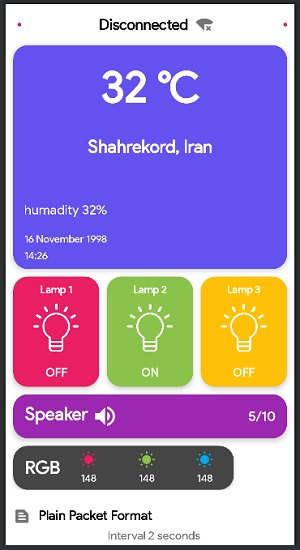

# App Sensor Data Logger

## Esp8266 + Android Networking + Lottie

---

## Description

Just Another Android app that reads and displays sensor information from the server.

When you log in, it takes your IP address and connects to port 80 and can read and display information from the Django server or Esp8266 or any other server by the IP address of that server.

In fact, this app reads a packet of information from the server and decodes it and shows it. 
The format of the read packet along with its description is placed at the bottom of this page.

The app updates the information from the server in two-second intervals so that we always have up-to-date information!
In the release section, you can download and install the latest debug version of the program for testing from right part of this page.

working on Androi +5

---

## Format Packet
| 0 | / | R | / | G | / | B | / | EpochTime | / | temp | / | hu | / | RED | / | GREEN | / | BLUE | / | SpeakerVolume |
|---|---|---|---|---|---|---|---|----------------------------|---|------|---|----|---|-----|---|-------|---|------|---|---------------|

---

## Important methods in project

- getDataFromEsp() -> Request for new packet from server
- resolvePacket() -> Decode packet and show data in app
- startAutomaticUpdating() -> update packet from server every 2 seconds
- normalizeNumber() -> normalize rgb (0-255) values from packet to (0-1) values to creae a Color and show in app
 
---

## Author Info
- Amir HOSSEIN MOHAMMADI
- Instagram - [@dunijet](https://www.instagram.com/dunijet/)
- GitHub - [@amir00462](https://github.com/amir00462)
- E-mail - amir00462@gmail.com
